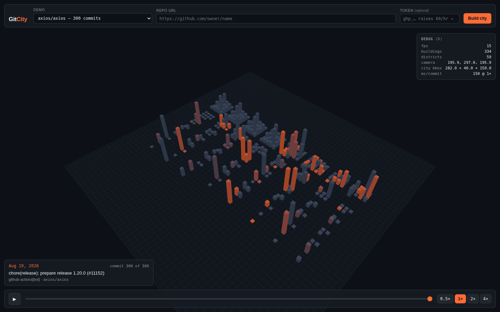

# Git City

**Paste a GitHub repo URL and watch its history build itself, commit by commit, as a 3D city.**

Every file is a building. Every folder is a district. A building's height is its
line count, and it glows orange the moment a commit touches it, cooling back to
slate over the next twenty commits. Play it back and you can see a codebase
grow, sprawl, get refactored, and lose whole neighbourhoods to a delete.



> **Demo GIF placeholder** — drop a recording at `docs/demo.gif` and swap the
> image above for ``.

**[▶ Live demo](https://ayushchangedia.github.io/Git-City/)** · no build step,
no backend, no install.

---

## What it does

- **Three bundled repos** replay instantly with **zero API calls** — the commit
  data is pre-generated and committed to `data/`.
- **Any public repo** can be fetched live, capped at the 300 most recent
  commits, with an optional token field.
- **Roughly 45 seconds** of playback regardless of repo size, scrubbable, at
  0.5×–4× speed.
- **Everything runs in the browser.** No server, no bundler, no framework.

## Controls

| | |
|---|---|
| `space` | play / pause |
| `d` | toggle the debug panel (FPS, building count, camera, bounding box) |
| drag | orbit — this also pauses the slow auto-orbit |
| scroll | zoom |
| scrubber | jump anywhere in history |

`?demo=data/axios-axios.json` or `?repo=owner/name` in the URL skips straight to
a dataset.

---

## How it works

### Buildings

One building per file path, standing on the ground plane at `y = 0`.

```
footprint      4 x 4 units, 2 unit gap  ->  6 unit pitch
height         clamp(lines / 20, 1, 40)
colour         #ff6b35 when just touched, lerping to #4a5568 over 20 commits
```

Growth, height changes and demolition all animate over 300ms with an ease-out
cubic. A removed file sinks to zero and is then disposed of properly — geometry
is shared across every building, materials are per-building and released on
removal.

### Districts

Files are grouped by their folder. Inside a district, buildings pack into a grid
of `ceil(sqrt(n))` columns. Districts are then laid out in their own grid,
largest first, with 10 units of padding between them, and the whole city is
centred on the origin.

Because the layout is a pure function of the current path set, it is recomputed
from scratch whenever a file appears or disappears — and buildings slide to
their new spots over 300ms, so the city visibly rearranges itself instead of
teleporting.

### The camera

The camera position is **never hardcoded**. After each layout:

1. Compute the bounding box of the whole city.
2. Model it as the cylinder enclosing its footprint — a cylinder radius does not
   depend on azimuth, so a fit that works at one angle works at every angle the
   auto-orbit passes through.
3. Bisect for the smallest distance at which every point on that cylinder still
   projects inside the frustum, with a 20% margin, checking **both** fields of
   view (on a portrait window the horizontal one binds).
4. Place the camera at 45° elevation, point `OrbitControls` at the box centre,
   with damping on.

As the city grows the framing is recomputed and the camera eases outward. It
only ever pulls back, never in, so a deliberate zoom is not undone a frame
later. While playing, the camera auto-orbits at 0.15 rad/sec, which suspends
while you are dragging.

A `GridHelper` on the ground is deliberately load-bearing as a diagnostic:

- Grid **and** buildings → working.
- Grid but **no buildings** → the data is wrong.
- **Nothing at all** → the camera is wrong.

---

## The data schema

Every dataset — bundled or fetched live — is this shape:

```json
{
  "repo": "facebook/react",
  "generatedAt": "2026-08-19T18:41:02.511Z",
  "commits": [
    {
      "sha": "abc123",
      "date": "2026-08-19T18:41:02.511Z",
      "message": "first line only, truncated to 80 chars",
      "author": "name",
      "files": [
        { "path": "src/index.js", "status": "added", "lines": 340 }
      ]
    }
  ]
}
```

| field | meaning |
|---|---|
| `repo` | `owner/name`, shown in the HUD |
| `generatedAt` | ISO timestamp of generation |
| `commits` | **oldest first** — this is playback order |
| `commits[].sha` | short sha |
| `commits[].date` | ISO author date |
| `commits[].message` | first line only, truncated to 80 characters |
| `commits[].author` | author name |
| `commits[].files[].path` | repo-relative path; its folder becomes the district |
| `commits[].files[].status` | `added`, `modified`, or `removed` |
| `commits[].files[].lines` | **running total** line count of that file *after* this commit |

`lines` is the important one. It is not the number of lines changed — it is the
accumulated `additions - deletions` for that file across the history so far, so
a building's height is the size of the file at that point in time. It is never
negative and is floored at `1`, so a file that has been emptied still leaves a
stub rather than vanishing.

Datasets are listed in [`data/manifest.json`](data/manifest.json), so adding a
demo to the dropdown is a data change, not a code change:

```json
[{ "file": "data/axios-axios.json", "repo": "axios/axios", "label": "axios/axios — 300 commits" }]
```

---

## Generating data for your own repo

`scripts/fetch-history.js` needs Node 18+ and has no dependencies.

### From a clone (recommended)

```bash
node scripts/fetch-history.js --git https://github.com/axios/axios
node scripts/fetch-history.js --git ../my-local-checkout --out data/mine.json
```

This clones once and walks the **full** history with `git log --numstat`, so
running totals are exact all the way back to the repository's first commit, and
it costs no API budget at all. Merge commits are skipped (every content change
lives in exactly one non-merge commit, so nothing is double-counted) and rename
detection is off, so a rename reads as a demolition plus a new building.

### From the GitHub API

```bash
node scripts/fetch-history.js --repo axios/axios --token $GITHUB_TOKEN
```

Portable, but the changed-file list costs **one request per commit**: 300
commits is 300+ requests against a budget of 60/hour anonymously or 5000/hour
with a token. Totals also start from zero at the window's edge, because commits
older than the window are never fetched. Capped at 300 commits.

### Synthetic

```bash
node scripts/fetch-history.js --synthetic
```

Writes `sample/demo-repo` — 120 commits across 61 files in 6 folders, from a
seeded PRNG so it is reproducible. Useful when the API is unreachable and you
still want real input for the renderer.

Then add the file to `data/manifest.json` and it shows up in the dropdown.

---

## Verifying without rendering

```bash
$ node scripts/verify.js
```

`scripts/verify.js` imports **`js/layout.js` — the same module the browser
uses** — and replays a dataset in Node to print what the renderer will produce.
The verifier and the renderer cannot disagree about where a building goes or
where the camera ends up.

```
axios/axios   (data/axios-axios.json)
──────────────────────────────────────────────────────────────
  commits            300
  buildings (final)  334
  districts          59

  building height    min 1.0   median 5.6   max 40.0
  largest district   docs/es/pages/advanced (25 files, 5x5)

  city bbox          282.0 wide x 40.0 tall x 150.0 deep
  camera position    195.9, 297.0, 195.9
  camera distance    391.7  (fov 55, 45° elevation, 20% margin, aspect 1.78)

  scale check        footprint 282.0 units — OK
```

It exits non-zero if a city's footprint falls outside 20–5000 units, which is
the band where the scale is sane — smaller and the buildings are specks, larger
and the camera is so far out that everything aliases into mush.

---

## Running locally

`fetch()` cannot read `data/*.json` from a `file://` URL, so serve the folder:

```bash
python3 -m http.server 8000
# then open http://localhost:8000
```

## Deploying

It is a static site. Push to `main`, then **Settings → Pages → Source: Deploy
from a branch → `main` / `/ (root)`**. `.nojekyll` is committed so that Jekyll
does not interfere.

## Project layout

```
index.html                 markup + the three.js import map
css/style.css              all styling
js/main.js                 bootstrap, scene, camera framing, DOM wiring
js/layout.js               pure geometry — districts, positions, camera fit
js/city.js                 meshes, tweens, building lifecycle
js/timeline.js             playback state machine
js/github.js               dataset loading, live API, rate-limit handling
data/*.json                pre-generated commit data
data/manifest.json         which datasets appear in the dropdown
scripts/fetch-history.js   dataset generator
scripts/verify.js          headless geometry check
```

`js/layout.js` exists so the geometry can be verified in Node without a
renderer; `js/city.js` re-exports it, so it is a single import either way.

## Not in v1

Video export, language-specific parsing, file-content analysis, authentication
beyond the token field, and any framework or build step.

## License

MIT — see [LICENSE](LICENSE).
